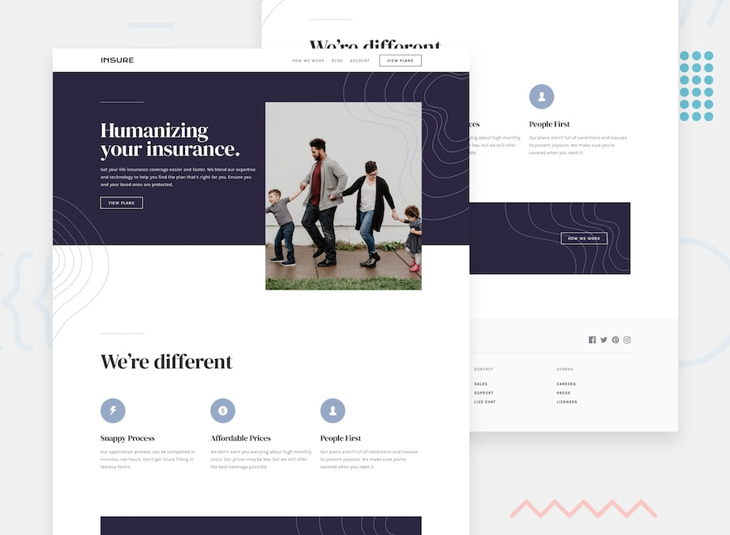

# Insure page with dark theme and features grid

### LIVE DEMO
https://vanneka.github.io/insure-landing-page/

## Hi There! 👋
This is my entry for the Frontend Mentor challenge

The task was to build out the project to the designs inside the `/design` folder. 

The images in the `/images` folder have been optimised for desktop and mobile versions.

The `style-guide.md` file, contains the information for the color palette and fonts.

## Testing RWD (Responsive Web Design)
1. Open `index.html` file in browser.

2. Right click and click on `inspect element`

3. Change device size from the top of browser to test responsiveness

**Yay!!!** 🚀
